<!-- ============ Bloom Header ============ -->

  <picture>
    <source media="(prefers-color-scheme: dark)" srcset="bloom-header-night.svg" />
    
  </picture>
  

    <h2 style="font-size:26px; color:#F4795B; font-weight:600; margin:0;">📮 Email: 1463339677@qq.com</h2>
  

<!-- ============ Sky ============ -->

  <picture>
    <source media="(prefers-color-scheme: dark)" srcset="sky-night.svg" />
    
  </picture>

<!-- ============ Research Directions 研究方向区域 ============ -->

  
  
  
  

<!-- ============ Stats ============ -->

<!-- ============ Snake（此区域上下间距最小化） ============ -->

  

<!-- ============ Footer (a cat lives here) ============ -->

  <picture>
    <source media="(prefers-color-scheme: dark)" srcset="garden-footer-night.svg" />
    
  </picture>

